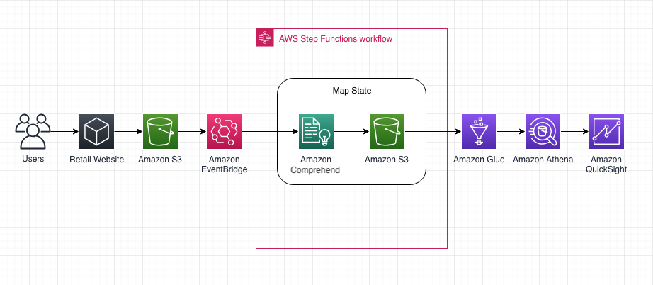
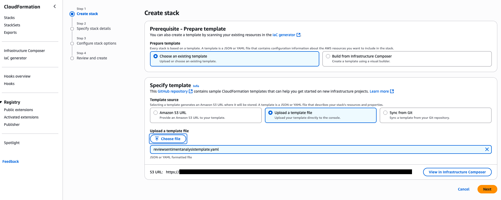
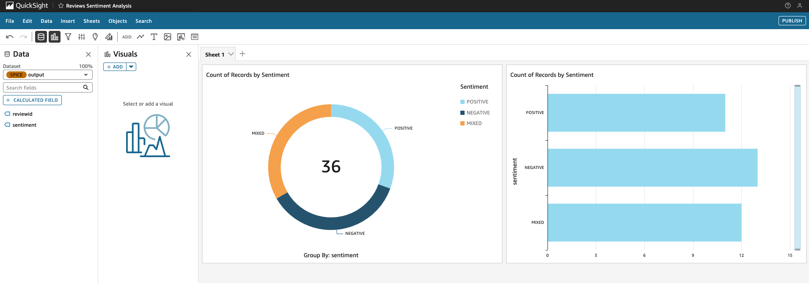

## Automating Sentiment Analysis

This reference solution automates the process of analyzing the sentiment of customer reviews and visualizing the results in Amazon QuickSight. It also introduces parallel processing by leveraging AWS Step Functions Map state and SDK service integrations.



## Deployment

Download AWS CloudFormation template [reviewsentimentanalysistemplate.yaml](reviewsentimentanalysistemplate.yaml) and reviews file [allreviews.csv](allreviews.csv) to your local machine.

From the AWS CloudFormation console, create an AWS CloudFormation stack by going to **Stacks**, **Create stack**, **With new resources (standard)**. Upload the template as shown below and click **Next**:



Enter a **Stack name** and click **Next**. Check the checkbox that says **I acknowledge that AWS CloudFormation might create IAM resources with custom names.** and click **Next**. Click **Submit** and wait until the stack creation is completed.

Alternatively, you can create the AWS CloudFormation stack with the AWS CLI by editing the following example:

```
aws cloudformation create-stack --stack-name <your-stack-name> --template-body file://reviewsentimentanalysistemplate.yaml --region <your-aws-region> --capabilities CAPABILITY_NAMED_IAM
```

Confirm that all the stack resources were created successfully, including Amazon S3 buckets **reviewsinputbucket1** and **reviewsoutputbucket1**, by checking the **Resources** tab in the stack details page.

Upload reviews file **allreviews.csv** to Amazon S3 bucket **reviewsinputbucket1**. This should generate one JSON file per processed review in Amazon S3 bucket **reviewsoutputbucket1**.

To automatically discover and catalog those JSON files as well as establish the integration with Amazon QuickSight, you will start by creating an AWS Glue crawler. From the AWS Glue console, click on **Crawlers**, then **Create crawler**, for **Name** enter **scan-sentiment-output** and click **Next**. Click **Add a data source**, for **Data source** select **S3**, for **Location of S3 data** select **In this account**, for **S3 path** enter **s3://reviewsoutputbucket1**, click **Add an S3 data source** and click **Next**. Under **IAM role** click **Create new IAM role**, for **Enter new IAM role** enter **AWSGlueServiceRole-sentimentgluecrawlerrole**, click **Create** and click **Next**. Under **Target database** click **Add database**, for **Database name** enter **sentiment-results**. Under **Crawler schedule** set **Frequency** to **Custom (cron expression)**, enter expression `1/10 * * * ? *` which should translate to **Every 10 minutes, starting at 1 minutes past the hour** and click **Next**. Click **Create crawler** and wait for the crawler to complete its first run and create Database **sentiment-results** and Data Catalog table **reviewsoutputbucket1**.

From the Amazon Athena console, go to **Query editor**, for **Data source** select **AwsDataCatalog**, for **Catalog** select **None**, for **Database** select **sentiment-results** and confirm that table **reviewsoutputbucket1** is showing along with its two columns **sentiment** and **reviewid**.

Open the Amazon QuickSight console as an administrator user. Click on the user icon in the top right corner, set the region to **N. Virginia** and click **Manage QuickSight**. Go to **Security & permissions** and if **Amazon Athena** and **Amazon S3** are not in the list of services that Amazon QuickSight is granted access to click on **Manage** and add them. Go to **SPICE capacity** and check that you haven't reached your available capacity; if you don't have enough unused capacity you can purchase more by clicking **Purchase capacity**. Go back to the Amazon QuickSight console by clicking on **QuickSight** in the top left corner. If your deployment is in a different region, switch to that region and go to **Datasets**, **New dataset**, under **From new data source** select **Amazon Athena**, for **Data source name** enter **reviews-sentiment-analysis**, click **Create data source**, for **Catalog** select **AwsDataCatalog**, for **Database** select **sentiment-results**, for **Tables** select **reviewsoutputbucket1**, select **Import to SPICE for quicker analytics** and click **Visualize**. Go to **Analyses**, **New Analysis**, from **Your Datasets** choose dataset **reviewsoutputbucket1** and click **Create analysis**. Select field **sentiment**, add a **Donut chart** visual and **Horizontal bar chart** visual and publish the visualization as a dashboard by clicking **Publish**.



Going forward, any additional reviews you upload to Amazon S3 bucket **reviewsinputbucket1** will get automatically processed. The Amazon QuickSight dashboard will also account for those new reviews once the AWS Glue crawler discovers the newly generated JSON files in Amazon S3 bucket **reviewsoutputbucket1** in 10-minute increments.

## Cleanup

Open the Amazon QuickSight console as an administrator user and delete the dashboard, analysis and dataset.

Open the AWS Glue console and delete the crawler and database.

Open the AWS CloudFormation console and delete the stack.

Alternatively, you can delete the AWS CloudFormation stack with the AWS CLI by editing the following example:

```
aws cloudformation delete-stack --stack-name <your-stack-name>
```

## Security

See [CONTRIBUTING](CONTRIBUTING.md#security-issue-notifications) for more information.

## License

This library is licensed under the MIT-0 License. See the LICENSE file.

